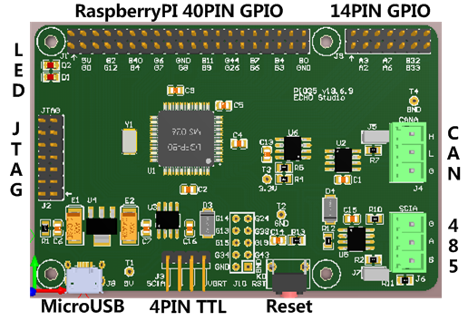
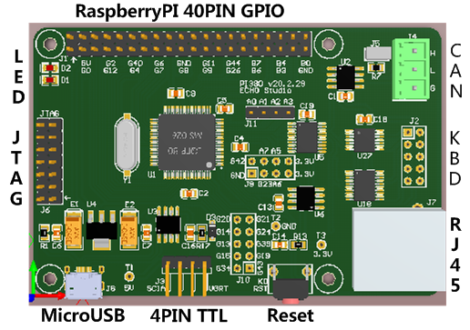

# PI035

A TMS320F28035 Development Board which compatible with Raspberry PI.

## Summary of Resources:

- [User Manual PDF](DOC/PI035_UM_v20.3.11.pdf)
- [PIPROG User Manual PDF](DOC/PIPROG_UM_v20.3.11.pdf)
- [PI035 Schematic PDF](SCH/PI035_Sch_v19.6.9.pdf)
- [PI380 Schematic PDF](SCH/PI380_Sch_v20.2.29.pdf)
- [XBOOT Bootloader](https://github.com/xjtuecho/XBOOT/blob/master/FW/PI035/XBOOT_v19.6.13_PI035.hex)
- [XBOOT Command Line Reference](https://github.com/xjtuecho/XBOOT/blob/master/DOC/XBOOT_PI035_CmdRef.md)
